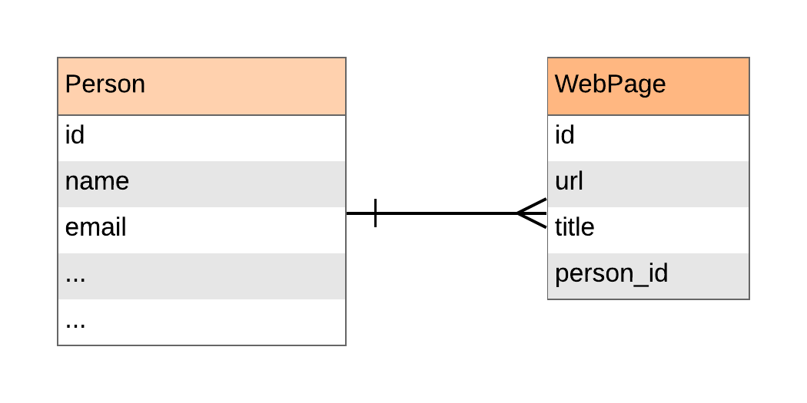
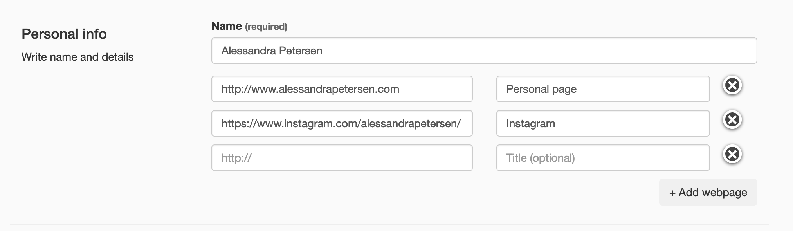

# Form sets

Form sets are the secret weapon ofthis library. Imagine you have models like this:

{: width=400 }
{: style=text-align:center }

With most form libraries, you would need to have a page for creating/updating the URLs and, only then, you would be able to create/update the person data. What a waste of time!

With a form set, you can create/update the person *and* its URLs at the same time, in a single form.

[](img/form-set-form.png)

To do so, you need to create two forms, one for the person data, and other for a website, and connect them like this:

```python
class WebPageForm(Form):
    url = URL()
    title = Text()

class PersonForm(Form):
    name = Text()
    webs = FormSet(WebPageForm)
```

a `FormSet` is a special kind of `Field` that represents a list of forms, to create or edit several items, in the same page, at once.

Now that you have a formset you can iterate over the forms in it and display them as you would with a regular form.

In the console:

```python
>>> form = PersonForm()
>>> list(form.webs)
[WebPageForm]
```

or in a template like this one

```html+jinja
<div class="form-group">
  <label>Name <small>(required)</small></label>
  {{ form.name.as_input(class="form-control") }}
  {{ form.name.render_error() }}
</div>
<div class="row">

  <div class="col-sm-6">
    {{ f.url.as_input(class="form-control", placeholder="http://") }}
    {{ f.url.render_error() }}
  </div>
  <div class="col-sm-5">
    {{ f.title.as_input(class="form-control", placeholder="Title (optional)") }}
    {{ f.title.render_error() }}
  </div>

</div>
```
... that renders into

```html
<div class="form-group">
  <label>Name <small>(required)</small></label>
  <input class="form-control" name="name" type="text" value="">
</div>
<div class="row">
  <div class="col-sm-6">
  	<input class="form-control" name="url" placeholder="http://"
      type="url" value="">
  </div>
  <div class="col-sm-5">
  	<input class="form-control" name="title" placeholder="Title (optional)"
      type="text" value="">
  </div>
</div>
```

As you can see it only displayed one, empty, `WebPageForm`. It creates one for each item in the input or object data (and we have none), plus the value of the `extra` attribute, that is one by default. You can set it to 0 or to a larger number to change that.

```python
>>> class PersonForm(Form):
...     webs = FormSet(WebPageForm, extra=3)

>>> list(PersonForm().webs)
[WebPageForm, WebPageForm, WebPageForm]
```

Iterating over the formset will render the forms in the order they were created. FormSets can also be indexed into, which returns the corresponding form.


## Using object data with a formset

As shown above you can define the number of extra forms. What this means is that you are telling the formset how many additional forms to show in addition to the number of forms it generates from the object data. Let’s take a look at an example:

```python
>>> class WebPageForm(Form):
...     url = URL()
...     title = Text()

>>> class PersonForm(Form):
...     name = Text()
...     webs = FormSet(WebPageForm)

>>> form = PersonForm(object={
...     "webs": [
...         {"id": 1, "url": "http://example.com/1", "title": "Example 1"},
...         {"id": 2, "url": "http://example.com/2", "title": "Example 2"},
...     ]
... })

>>> list(form.webs)
[WebPageForm, WebPageForm, WebPageForm]

>>> form.webs[1].url.name
'webs--2--url'

```

There are now a total of three forms showing above. Two for the object data that was passed in and one extra form. Also note the format of the HTML names of the fields in the forms of the formset. It follows this format:

*form_prefix*. *formset_name* \-\- **OBJECT_ID** \-\- *field_name*
{: style="text-align:center;font-family:monospace;font-size:larger;font-weight:bold" }

Notice how this imply each object **must** have a distinct ID, even if the data comes as dictionaries.

Why Proper Form doesn't use a a simple counter, like the rest of form libraries? The answer it's to protect you from *race conditions*. You want to update a specific object, not just "the second object from the list", because there is no guarantee the list hasn't changed while the form was filled by the user.  Using IDs guarantees that you are updating the object you wanted to, even if is not in the same order as before.

!!! note
    *“But... what if the user manually change the IDs in the names? Would they be able to change the data of any other objects, like the one from another users?!”*

    No, don't worry! Proper Form ignore any ID that isn't in the current list of objects. This feature prevents anyone to access/update data they shouldn't.

!!! note
    In the example we are passing in a list of dictionaries as the object data, but the most common scenario will be using the result of a query using an ORM. In any case, it makes no difference.


## Using input data with a formset

A formset can accept any number of new forms. A "new form" are those that aren't created for editing an existing object, but added client side. To do so, the names of the fields must follow this pattern:

*prefix*. *formset_name* \-\- \_NEWx \-\- *field_name*
{: style="text-align:center;font-family:monospace;font-size:larger;font-weight:bold" }

where "x" is a number shared by all the fields of a form. They doesn't have to be correlative, but they must be different for each form, example:

```javascript
webs--_NEW1--url
webs--_NEW1--title

webs--_NEW2--url
webs--_NEW2--title

webs--_NEW3--url
webs--_NEW3--title
```

If you create a formset with `can_create=False`, all the new forms are ignored.


## Deleting existing forms

Formsets monitor the presence of a special name to know if it has to delete a form and, more importantly, its related object. Not including the form fields doesn't do anything, to actually delete its object you must send to the form field with a name that follows this pattern:

*prefix*. *formset_name* \-\- *OBJECT_ID* \-\- \_DELETED
{: style="text-align:center;font-family:monospace;font-size:larger;font-weight:bold" }

If you create a formset with `can_delete=False`, this special name is ignored.


## Arguments

```python
FormSet(
    FormClass,
    backref=None,
    extra=1,
    min_num=None,
    max_num=None,
    can_delete=True,
    can_create=True,
    error_messages=None,
)
```

### FormClass

### backref <small>(`None`)</small>

If your forms inside the formset have a `_model` attribute, they will update/create rows in a database when saving the parent form, as expected.

When that's the case, the `backref` attribute is something you might need to add.

#### Without backref


**Without** a `backref` attribute, Proper Form will try to save the child forms first, and them assign the list of them to the parent form. If you are dealing with models instead of dictionaries, your database might not like that.

In the example above, a WebPage model will have a non-nullable `person_id` field. If we save those forms first, you will not have yet a `person` to get the ID from, so the save operation is going to fail.

We'll need to create a person first, *and then* create the child objects using the person as an argument.


#### With backref

```python
# Possible SQLAlchemy models

class WebPage(Model):
  url = Column(Text)
  title = Column(Text)
  owner_id = Column(Integer, ForeignKey("owner.id"))
  owner = relationship("Person", back_populates="webs")

class Person(Model):
  name = Column(Text)

```

A `backref` is how the child models call its parents, in this example, is "owner", so we use that as a backref attribute:

```python
class WebPageForm(Form):
  url = URL()
  title = Text()

class PersonForm(Form):
  name = Text()
  webs = FormSet(WebPageForm, backref="owner")
```

When Proper Form receives a `backref`, it reverse the order of the form saving. Now first it creates the parent object, and then the child objects using the parent object as an attribute.


In this way, no database constraints are broken and the saving of the form finish without problems.


### extra <small>(`1`)</small>

Number of extra empty forms added to the list, even if there is no data available.


### min_num <small>(`None`)</small>

Validates that the number of sub-forms, existing plus new, is *at least* this.


### max_num <small>(`None`)</small>

Validates that the number of sub-forms, existing plus new, is *at most* this.


### can_delete <small>(`True`)</small>

If this option is `False`, [the special name](#deleting-existing-forms) to delete a form is ignored and no objects are deleted.

### can_create <small>(`True`)</small>

If this option is `False`, [the data from all new forms](#using-input-data-with-a-formset) is ignored. You can only use the formset to edit the data of pre-existing objects.

### error_messages <small>(`None`)</small>

The `min_num`, and `max_num` validations fail with this predefined error messages:

```python
default_error_messages = {
    "min_num": "Please submit at least {num} forms.",
    "max_num": "Please submit at most {num} forms.",
}
```

The `error_messages` argument allows you to overwrite all or one of these messages by passing a dictionary with your custom error messages for those validations.


## Adding new forms with JavaScript

[TODO]

